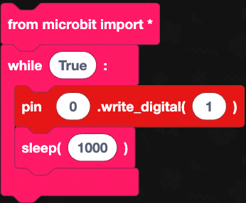
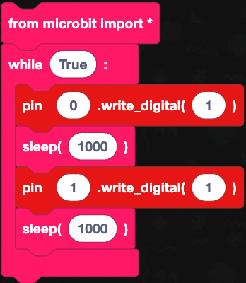
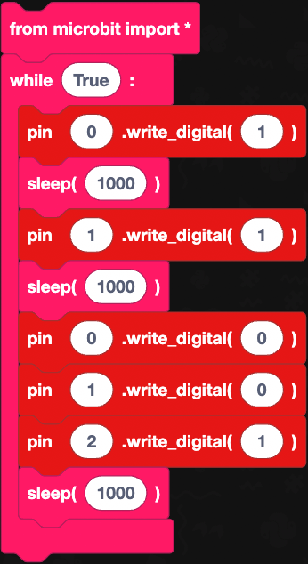
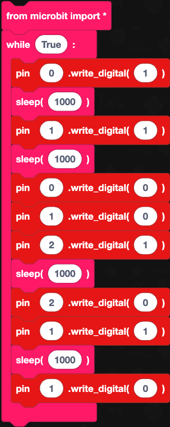

1. From the Imports menu within the Basic menu, select and drag a `from microbit import *` block to the code area and attach it to the `# start code here` block.
   
2. From Loops within the Basic menu, select and drag a `while True:` block to the code area and attach it under the `from microbit import *` block.
   
3. From the Pins menu, select and drag a `pin0.write_digital(0)` block to the code area and attach it within the `while True:` block.
   
4. Change the **2nd 0** within the `pin0.write_digital` block and type **1**.
   
5. From Statements within the Basic menu, select and drag a `sleep (1000)` block to the code area and attach it under `pin0.write_digital(1)` block.
   
 Your code should look like this:

 

 6. Right-click on `pin0.write_digital(1)` block and select **duplicate** attach the **duplicated** block under `sleep (1000)` block. Change the **0** to **1**.

7. Right-click on `sleep (1000)` and select **duplicate** attach the **duplicated** block under the `pin1.write_digital(1)` block. 

8. Right-click on the `pin0.write_digital(1)` and select **duplicate** attach the **duplicated** block under `sleep (1000)`. Change **1** to **0**.
   
9.  Right-click on `pin1.write_digital(1)` and select **duplicate** attach the **duplicated** block under `pin0.write_digital(0)` block. Change the **2nd 1** to **0**.
    
10. Right-click on `pin1.write_digital(1)` block and select **duplicate** attach the **duplicated** block under `pin1.write_digital(0)` block. Change the **1st 1** to **2**.
    
11. Right Click on `sleep (1000)` and select **duplicate** attach the **duplicated** block under `pin2.write_digital(1)`. 

1.  Right-click on `pin2.write_digital(1)` and select **duplicate** attach the **duplicated** block under `sleep (1000)`. Change the **1** to **0**.

2.  Right-click on `pin1.write_digital(1)` block and select **duplicate** attach the **duplicated** block under `pin2.write_digital(0)` block.

3.  Right-click on `sleep (1000)` and select **duplicate** attach the **duplicated** block under `pin1.write_digital(1)` block.

4.  Right-click on `pin1.write_digital(0)` block and select **duplicate** attach the **duplicated** block under the `sleep (1000)` block.

Completed code:

Lets move on and download our code to the micro:bit.
