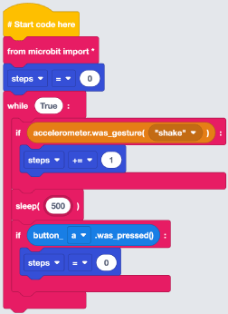

## Importing Python Libraries

From the Imports menu which is found under the Basic menu, select and drag a `from microbit import *` block to the code area and attach it to the `# start code here` block.

## Creating Steps Variable

:info[WHAT IS A VARIABLE]
Think of a variable as a box that stores information that can be used throughout our program. We give variables a descriptive name so we and others can understand what is going on within our program.
:

1. From the Variables menu, select **New variable…**. Give it the name **steps** press Enter.
2. From the Variables menu, select and drag a `steps = 0` block to the code area and attach it under the `from microbit import *`. Select **r** and pick **steps.

## Creating a While Loop

From the Loops menu which can be found under the Basic menu, select and drag a `while True:` block to the code area and attach it under the `steps = 0` block.

## Creating the Shake Function

1. Select Logic from the Basic menu, Select and drag an `if True:` block to the code area and attach it within the `while True:` block.
2. From the Accelerometer menu, select and drag an `accelerometer.was_gesture(‘shake’)` block and attach it within the **True** of the `if` block.

## Increasing Steps

From Variables, select and drag a `steps = 0`  block to the code area and attach it within the  `if accelerometer.was_gesture(‘shake’)` block. Select **r** and choose **steps** . Select the **=** and choose **+=**. Change the **0** to **1**.

## Pausing the Code for 500ms

From Statements within the Basic menu, select and drag a `sleep(1000)` block to the code area and attach it below the `if accelerometer.was_gesture('shake')` block. Change **1000** to **500**. This will pause your code for half a second. 

## Resetting Steps to 0

1. From Logic within Basic, select and drag an `if True:` block to the  code area and attach it under the `sleep(500)` block.
2. From Buttons, select and drag a `button_a.was_pressed()` block to the code area and attach it within the **True** of the `if` block.
3. From Variables, select and drag a `steps = 0` block to the code area and attach it within the `if button_a.was_pressed()` block.

## Displaying Steps on the LED Matrix

1. From Display, select and drag a `display.scroll ("Hello World")` block to the code area and attach it under the `if button_a.was_pressed()` block.
2. From Variables, select and drag a `steps` block to the code area and attach it within the **"Hello World"** of the `display.scroll ()` block.

We have now completed our code. Lets move on to downloading our code to the micro:bit.