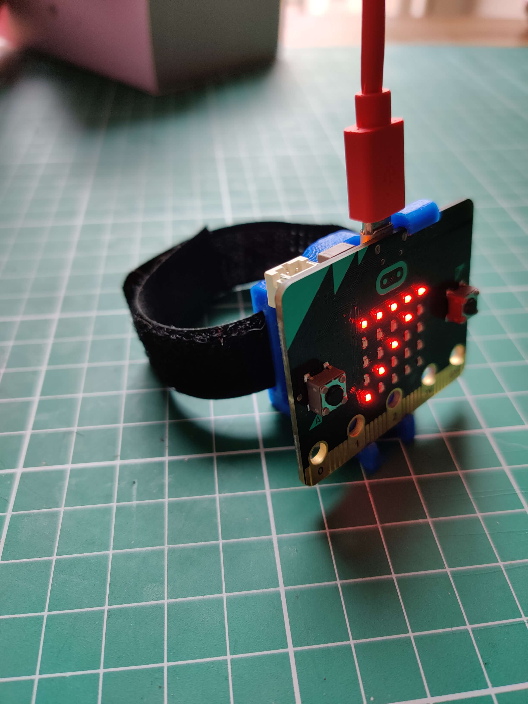

## Overview

We are all familiar with Fitbit and other smart watches even our phones counting our steps throughout the day. Let’s use a micro:bit to code our own.

## What you will Learn

How to:

- [ ] Create and use a variable.
- [ ] The micro:bit shake function.
- [ ] Use a while True loop.
- [ ] Display a number on the LED matrix.
- [ ] Use the button function.

## What you will Need

- 1 x micro:bit
- 1 x micro USB cable
- 1 x battery pack for the micro:bit (optional)

Lets move on to opening the EduBlocks editor.