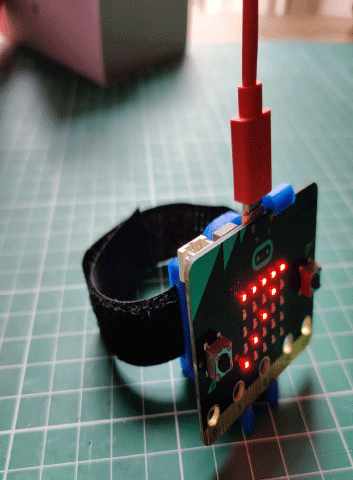

## Overview

Ever wonder how your smartwatch knows exactly how many steps you've taken? In this exciting project, we'll demystify fitness tracking technology by creating our own step counter using a micro:bit! Unlike expensive commercial devices, our DIY fitness tracker will help you understand the basic principles of motion detection and how simple sensors can count your daily steps.

Using the micro:bit's built-in accelerometer, we'll program it to detect movement patterns that match walking or running motions. You'll learn how real fitness trackers work while building your own wearable device that displays your step count right on the LED matrix. Best of all, you'll gain hands-on experience with physical computing, data processing, and real-world sensor applications.

Whether you're interested in wearable technology, fitness tracking, or just love creating cool gadgets, this project offers a perfect blend of computer science and physical activity. By the end, you'll have your very own working step counter and a deeper understanding of the technology we use every day!

## What you will Learn

How to:

- [ ] Create and use a variable.
- [ ] The micro:bit shake function.
- [ ] Use a while True loop.
- [ ] Display a number on the LED matrix.
- [ ] Use the button function.

## What you will Need

- 1 x micro:bit
- 1 x micro USB cable
- 1 x battery pack for the micro:bit (optional)

Lets move on to opening the EduBlocks editor.