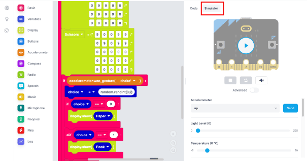
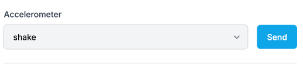

## Web Browser

The EduBlocks Editor has a built-in micro:bit simulator so you can use this if you don't have a micro:bit handy.

1. On the right-hand side of your screen select **simulator**.

2. From the **Accelerometer** menu below the simulator select **shake**
3. Select **send** this will now simulate a shake of the micro:bit and display either rock, paper or scissors on the micro:bit simulator.

## Using the micro:bit

Once you have downloaded the code to your micro:bit you can shake the micro:bit and see a rock, paper or scissors image appear on it.

Find a partner and start playing or play against yourself.