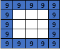

## Importing Python Libraries

1. Select Basic. Select and drag a `from microbit import *` block to the code area and drop it.
2. Select Basic. Select and drag an `import random` block to the code area and attach it under the `from microbit import *` block.

Here is what your code looks like so far:

## Creating the While Loop

1. Select Basic. Select and drag a `while True:` block to the code area and attach it under the `import random` block.

Your code should look like this:

## Creating the Rock Paper Scissor Variables

:::info[What is a variable]
Think of a variable as a box that stores information that can be used throughout our program. We give variables a descriptive name so we and others can understand what is going on within our program.
:::

### Creating Paper

1. Select Display. Select and drag an `image =` block to the code area and attach it within the `while True:` block.
2. Drag another two `image =` blocks to the code area attaching them under the first `image =` block.
3. Within the first `image =` block create the following image to represent Paper by typing **9** (this represents the brightness of the LEDs) in the corresponding squares.

4. Select the drop-down arrow next to **image** and select **New variable** and name it **Paper**.

### Creating Rock

1. Create the following image to represent Rock by typing **9** within the corresponding squares. in the next `image =` block.

2. Select the arrow next to image and Select **New variable** and name it **Rock**.

### Creating Scissors

1. Create the following image to represent Scissors by typing **9** within the corresponding boxes in the remaining `image =` block.

2. Select the arrow next to **image** and select **New variable** and name it **Scissors**.

Your code should look like this:

### Creating the on shake Action

1. Select Basic. Select and drag an `if True:` block to the code area and attach it under **Scissors**.
2. Select Accelerometer. Select and drag an `accelerometer.was_gesture(‘shake’)` block to the code area and attach it within the **True** of the `if` block.
3. Select Variables. Select create variable and name it **choice**. Select OK or press **Enter** on the keyboard.
4. Select Variables. Select and drag a `choice =` block to the code area and attach it within the `if accelerometer.was_gesture(‘shake’)` block. Within the blank space type **random.randint(0,2)**.

### Creating the Choice = 0 Condition

1. Select Basic. Select and drag an `if True:` block to the code area and attach it below the `choice = random.randint(0,2)` block.
2. Select Basic. Select and drag a `0 == 0` block to the code area and attach it within the **True** of the `if` block.
3. Select Variables. Select and drag a `choice` block to the code area and attach it within the first **0** of the `if`block.
4. Select Display. Select and drag a `display.show(Image.HAPPY)` block to the code area and attach it within the `if choice == 0:` block.
5. Select Variables. Select and drag the `Paper` block to the code area and attach it within **Image.HAPPY**. 

Your code should look like this:

### Creating the Choice = 1 Condition

1. Select Basic. Select and drag an `elif` block to the code area and attach it below the `if choice == 0:` block.
2. Right-click on `choice == 0` and select **duplicate**. Attach the duplicated block within the **True** of the `elif` block. select **0** and type **1**.
3. Right-click on the `display.show(Paper)` block and select **duplicate**. Attach the duplicated block within the `elif choice == 1:` block. Select **Paper** and choose **Rock**. 

Your code should look like this:

### Creating the Choice = 2 Condition

1. Select Basic. Select and drag an `else:` block to the code area and attach it under the `elif choice == 1:` block.
2. Right-click on `display.show(Rock)` and select **duplicate**. Attach the duplicated block within the `else:` block. Select **Rock** and choose **Scissors**. 

Completed Code:

We have now finished coding rock paper scissors the next step is to download our code to the miro:bit.
