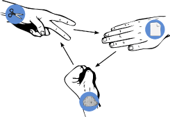

## Overview

In this engaging project, you'll learn how to program your micro:bit to play Rock Paper Scissors using a combination of buttons, gestures, and the LED display. We'll start by understanding the basic game logic and how to represent rock, paper, and scissors using different inputs. You'll discover how to use random selection for the computer's choice, display game outcomes using animations, and keep track of scores. Through this project, you'll develop fundamental coding concepts like variables, conditionals, and loops while creating something fun and interactive. By the end, you'll have a fully functional game that you can play with friends or challenge the computer – all powered by your micro:bit!

## What you will Learn

- [ ] How to create and use a Variable
- [ ] How to use the micro:bit accelerometer shake gesture
- [ ] How to display images/shapes on the LED matrix
- [ ] How to use conditional if/else statements
- [ ] How to use comparison operators
- [ ] How to randomise choices

## What you will Need

- 1 x micro:bit
- 1 x micro USB cable
- 1 x battery pack for the micro:bit (optional)