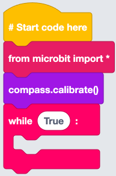
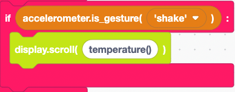
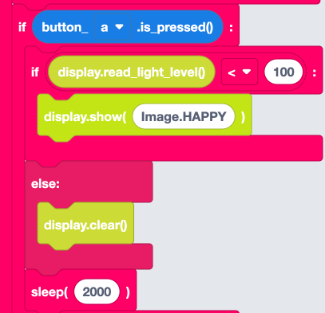
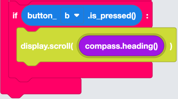
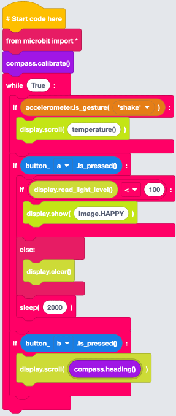

## Setting Up the Code Area

1. From Imports within the Basic menu,  select and drag a `from microbit import *` block to the coding area and connect it under the `# start code here` block.
2. From Loops within the Basic menu, select and drag a `while True:` block to the code area and attach it under `from microbit import *` block.
3. From the Compass menu, select and drag a `compass.calibrate()` block to the code area and attach it below the `from microbit import *` block.

## Temperature Sensing

1. From Logic within the Basic menu, select and drag an `if True:` block to the code area and attach it within the `while True:` block.
2. From the Accelerometer menu, select and drag an `accelerometer.is_gesture(‘shake’)` block to the code area and attach it within the **True** of the `if` block.
3. From the Display menu, select and drag a `display.scroll(0)` block to the code area and attach it within the `if accelerometer.is_gesture(‘shake’):` block.
4. Change the **0** of the `display.scroll` block and type **temperature(°)**.
 

We can now sense the temperature of the room you are in by shaking the micro:bit.

## Light Sensing

1. From Logic within the Basic menu, select and drag an `if True:` block to the code area and attach it under the `if accelerometer.is_gesture(‘shake’):` block.
2. From the Buttons menu, select and drag a `button_a.is_pressed()` block to the code area and attach it within the **True** of the `if` block.
3. From Logic within the Basic menu, select and drag an `if True():` block to the code area and attach it within the `if button_a.is_pressed():` block.
4. From Logic within the Basic menu,  select and drag a `0 = 0` block to the code area and attach it within the **True**  of the `if` block. Select the **=** and choose **\<**.

We can now use the micro:bit to detect if it’s light or dark within a room by pressing the A button on the micro:bit.

## Compass Sensing

1. From Logic within the Basic menu, select and drag an `if True:` block to the code area and attach it under `if button_a.is_pressed():` block.
2. Right-click on `button_a.is_pressed()` block and select **duplicate**. Attach the duplicated block within the **True** of the `if` block. select **a** and choose **b**.
3. From the Display menu, select and drag a `display.scroll("Hello World")` block to the code area and attach it within the `if button_b.is_pressed():` block.
4. From the Compass menu, select and drag a `compass.heading()` block to the code area and attach it within **Hello World** of the `display.scroll` block.

We can now see what the compass baring of the direction the micro:bit is facing by pressing the B button on the micro:bit.

## Completed Code

We are now ready to download the code to our micro:bit so we can go out and sense our environment.