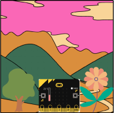

## Overview

We are going to explore our environment by using the temperature sensor, light sensor and compass on the micro:bit.

## What you will Learn

How to;

- [ ] Use the shake function.
- [ ] Display a number on the LED matrix.
- [ ] Use the temperature sensor.
- [ ] Use the button function.
- [ ] Use the if/else conditions.
- [ ] Use comparison operators.
- [ ] Display patterns on the LED matrix.
- [ ] Clear the LED matrix.
- [ ] Use the compass.
- [ ] Use the light sensor.

## What you will Need

- 1 x micro:bit
- 1 x micro USB cable
- 1 x battery pack for the micro:bit (optional)

Let's move on to opening the EduBlocks editor.