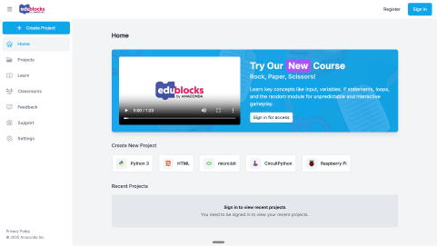
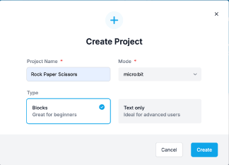
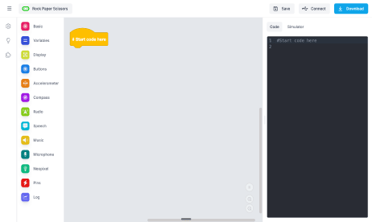

## Navigating to EduBlocks

1. Open your favourite browser ( we recommend Google Chrome).

2. Within the address bar of the browser type [app.edublocks.org](https://app.edublocks.org/) or on a tablet or phone press create code.

   

3. Select micro:bit under **Create New Project** to open the micro:bit coding editor. Name your project **Enviro Sensing** and make sure you have **Blocks** selected under **Type**. See the image below.

   

4. Select **Create** to open the micro:bit editor.

We are now ready to start coding!