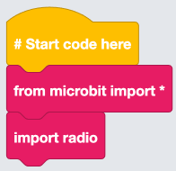
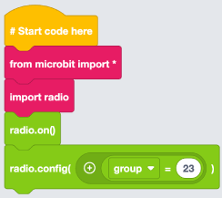
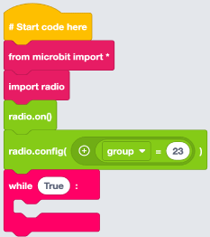
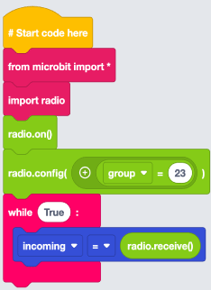
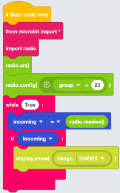
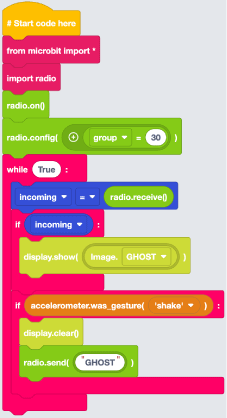

## Importing Libraries

1. From Imports within the Basic menu, select and drag a `from microbit import *` block to the code area and attach it under the `# start code here` block.

2. From Imports within the Basic menu, select and drag an `import radio` block to the code area and attach it under `from microbit import *` block.

## Configuring the Radio Module

1. From the Radio menu, select and drag a `radio.on()` block to the code area and attach it under the `import radio` block.

2. From the Radio menu, select and drag a `radio.config(group=23)` block to the code area and attach it under the `radio.on()` block. Change the **23** to **30**.

If you are working with more than one pair of micro:bits make sure the Channel value is different per pair.

## Creating the While Loop

From Loops within the Basic menu, select and drag a `while True:` block to the code area and attach it under the `radio.config(group=30)` block.

## Create Incoming Variable

:::tip[WHAT IS A VARIABLE]
Think of a variable as a box that stores information that can be used throughout our program. We give variables a descriptive name so we and others can understand what is going on within our program.
:::

1. From Variables select **Create variable...**. Name the variable **incoming**.

2. From Variables select and drag `incoming = 0` block to the code area and attach it under the `radio.config(group=30)` block.

3. From Radio select and drag a `radio.receive()` block and attach it within the **0** of the `incoming = 0` block.

## Configuring Incoming Message

1. From Logic within Basic, select and drag an `if True:` block to the code area and attach it under the `incoming = radio.receive()` block.

2. From Variables select and drag an `incoming` block to the code area and attach it within the  **True** of the `if` block.

3. From Display, select and drag a `display.show("Hello")` block to the code area and attach it within the `if incoming:` block.

4. From Display, select and drag a `Image.RABBIT` block to the code area and attach it within the **Hello** of the `display.show` block. Select **RABBIT** and choose **GHOST**

## Configuring Outgoing Message

1. From Logic within Basic, select and drag an `if True:` block to the code area and attach it under the `if incoming:` block.

2. From Accelerometer select and drag an `accelerometer.was_gesture(‘shake’)` block to the code area and attach it within the **True** of the `if` block.

3. From Display select and drag a `display.clear()` block to the code area and attach it within the `if accelerometer.was_gesture(‘shake’)` block

4. From Radio select and drag a `radio.send(“Hello”)` block to the code area and attach it under the `display.clear()` block. Change **`“Hello”** to **"GHOST"**.

Completed Code:

Now that we have completed our code. Lets download it to the micro:bit.
