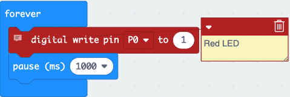
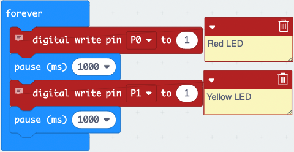
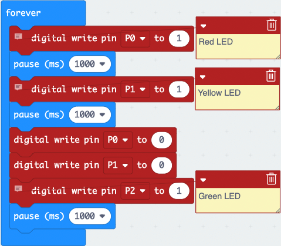
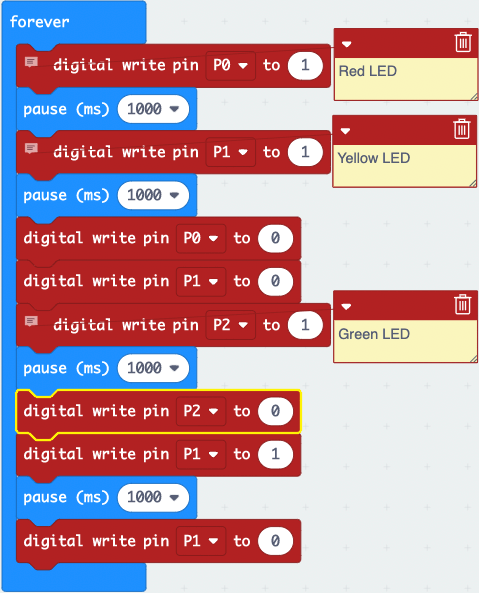

1. Select and drag the `on start` block to the left and drop it on the **bin**.
   
2. From the Pins menu within the Advanced menu, select and drag a `digital write pin P0 to 0` block to the code area and attach it within the `forever` block. Change the **0** to **1**.
   
3. From the Basic menu, select and drag a `pause (ms) 100` block to the code area and attach it under `digital write pin P0 to 1` block. Select **100** and Choose **1 second**. 

Your code should look like this:

4. Right-click on `digital write pin P0 to 1` block and select **duplicate**. Drag the **duplicated** block and attach it under `pause (ms) 1000` block.
   
5. Select the little dropdown arrow next to ***P0** and select **P1**.
   
6. Right-click on the `pause (ms) 1000` block and select **duplicate**. Attach the **duplicated** block under `digital write pin P1 to 1` block.

7. Right-click on `digital write pin P0 to 1` and select **duplicate** attach the **duplicated** block under `pause (ms) 1000` block.
   
8. Select the **1** and type **0** within the `digital write pin P0` block.
   
9.  Right-click on `digital write pin P0 to 0` block and select **duplicate** attach the block under the `digital write pin P0 to 0` block. Select **P0** and choose **P1**.
    
10. Right-click on `digital write pin P1 to 0` block and select **duplicate** and attach it under the original block. Select **P1** and choose **P2**. Change the **0** to **1**.

11. Right-click on `pause (ms) 1000` and select **duplicate** and place the duplicated block under `digital write P2 to 1` block.

12. Right-click `digital write pin P2 to 1` block and select **duplicate** and attach it below `pause (ms) 1000` block. Change the **1** to **0**.
    
13. Right-click on `digital write pin P1 to 1` and select **duplicate** attach the **duplicated** block under the `digital write pin P2 to 0` block.
    
14. Right-click on `pause (ms) 1000` and select **duplicate** and attach it under the `digital write pin P1 to 1` block.
    
15. Right-click on `digital write pin P1 to 0` block and select **duplicate** connect the **duplicated** block under the `pause (ms) 1000` block.
    
