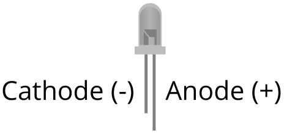
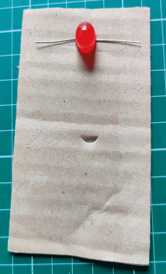
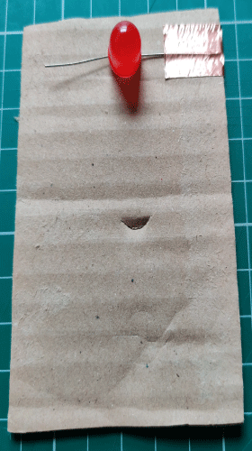
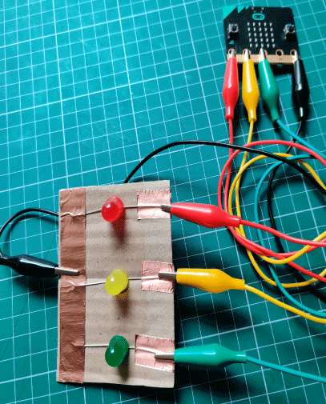

## What is an LED

An LED or Light Emitting Diode is a semiconductor light source that emits (gives off) light when current flows through it.

An LED has a longer leg called the anode (+) and a shorter leg called the cathode (-) as shown above.

## Creating the Circuit

1. Place the bit of cardboard on the desk.
   
2. Take the red LED and bend the legs out to the sides. Place the LED on the cardboard with the longer leg to the right.

    

3. Take a bit of copper tape or glue and some aluminium foil over the long leg of the red LED.
   
   

4. Complete steps 2 and 3 for the yellow and green LEDs.
   
5. Take a longer bit of copper tape or foil and tape/glue all three of the short legs of the LEDs together.
   
   

## Connecting the micro:bit

1. Take one of the crocodile/alligator leads and clip one end to the long piece of copper tape/aluminium foil covering the short legs of the LEDs and clip the other end to the GND pin of the micro:bit.
   
2. Take another crocodile/alligator lead and clip one end to the copper tape/aluminium foil of the longer leg of the red LED and attach the other end to pin 0 on the micro:bit.
   
3. Take another crocodile/alligator lead and clip one end to the copper tape/aluminium foil of the longer leg of the yellow LED and attach the other end to pin 1 on the micro:bit.
   
4. Take the last crocodile/alligator lead and clip one end to the copper tape/aluminium foil of the longer leg of the green LED and attach the other end to pin 2 on the micro:bit.

5. Take the micro USB cable and connect the micro:bit to the computer.
   

Let's move on and set-up our code editor.
