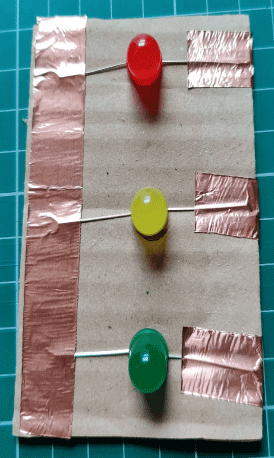

## Overview

By the end of this tutorial you will know what an LED is and how to connect and program them using a BBC micro:bit.

## What you will Learn

- [ ] How to use the micro:bit edge connector.
- [ ] How to connect LEDs to the micro:bit using crocodile/alligator clips.
- [ ] How to Create an electronic circuit.
- [ ] What an LED is.
- [ ] How to Light an LED up through code.

## What you will Need

- 1 x Red LED
- 1 x Yellow LED
- 1 x Green LED
- 1 x Piece of cardboard
- Copper tape / aluminium foil and glue
- 4 x Crocodile / alligator leads
- 1 x micro:bit (version 1 and 2 will work)
- 1 x Micro USB cable
- 1 x Battery pack for the micro:bit (optional)
  
Let's move on and create our traffic light circuit.
