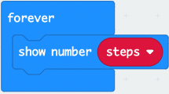

## Getting Started

1. Select and drag the `on start` block to the left of the screen and drop it on the **bin** icon to delete it.
2. From the Input menu, select and drag the `on shake` block to the code area and drop it.
3. From the Input menu, select and drag a `on button A pressed` block to the code area and drop it.
   
Your code area should look like this:

## Creating a Variable

:::info [WHAT IS A VARIABLE]
Think of a variable as a box that stores information that can be used throughout our program. We give variables a descriptive name so we and others can understand what is going on within our program.
:::

1. From the Variables menu select **make a variable...**.
2. Type **steps** and select OK or press Enter on your keyboard.

## Change Steps By

1. From the Variables menu, select and drag a `change steps by 1` block to the code area and attach it within the `on shake` function.

Everytime the micro:bit detects a shake it will increase the variable steps by 1.

Your code should look like this:

## Show Number

1. From the Basic menu, select and drag a `show number 0` block to the code area and attach it within the `forever` block.
2. From the Variables menu, select and drag a `steps` block to the code area and attach it within the **0** of the `show number` block.

This will run forever and display the number of steps on the LED matrix.

Your code should look like this:

## Set Steps To 0

From the Variables menu, select and drag a `set steps to 0` block to the code area and insert it within the `on button A pressed` block.

This will reset the step counter back to 0 when button A is pressed.

Your code should look like this:

## Completed Code

Here is our completed code for the step counter.

Let's move on and download the code to our micro:bit.