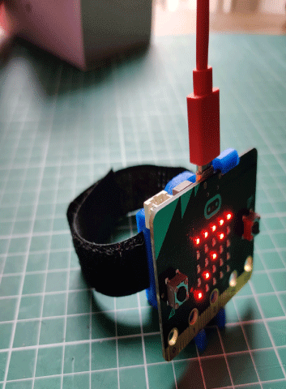

## Overview

We are all familiar with Fitbits and other smart watches even our phones counting our steps through the day. Lets use a micro:bit to code our own.

:::info[NOTE]
You do not need a micro:bit to do this tutorial you can use the simulator built into the MakeCode editor.
:::

## What you will Learn

- [ ] How to create and use a variable.
- [ ] How to use the micro:bit on shake function.
- [ ] How to use a forever loop.
- [ ] How to display a number on the LED matrix.
- [ ] How to use the button function.
  
Let's open our code editor.
