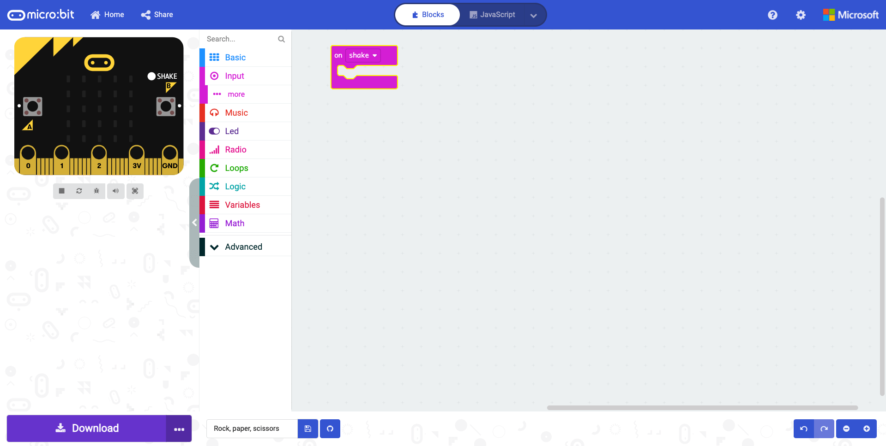
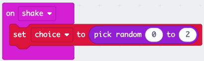
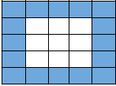
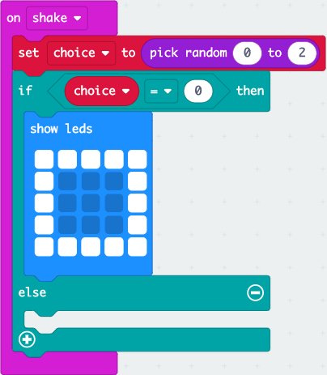
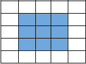
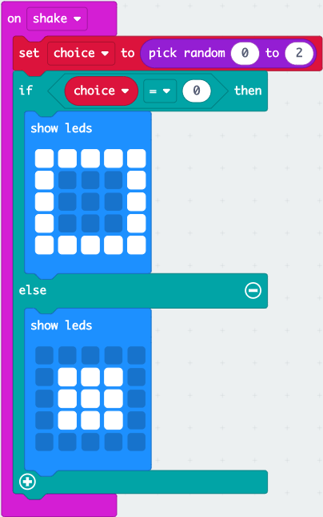
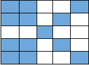
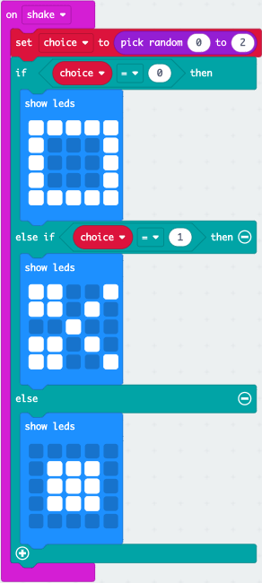

## Setting up the Code Area

1. Select and drag the `on start` block to the left of the screen and drop it on the bin.

2. Select and drag the `forever` block to the left of the screen and drop it on the bin.

3. Select Input. Select and drag the `on shake` block to the code area and drop it.

Your code area should look like this:

## Creating a Variable

:::tip[WHAT IS A VARIABLE]
Think of a variable as a box that stores information that can be used throughout our program. We give variables a descriptive name so we and others can understand what is going on within our program.
:::

1. Select Variables. Select make a variable...

2. Type choice and select OK or press enter on your keyboard.

## Set Choice To

1. Select Variables. Select and drag a `set choice to 0` block to the code area and attach it within the `on shake` block.

2. Select Math. Select and drag a `pick random 0 to 10` block to the code area and attach it within the **0** of the `set choice to` block.

3. Select **10** and type **2**.

Your code should look like this:

## If Condition

1. Select Logic. Select and drag an `if true then else` block to the code area and attach it under `set choice to pick random from 0 to 2` block.

2. Select Logic. Select and drag a `0 = 0` block to the code area and attach it within the **true** of the `if then` block.

3. Select Variables. Select and drag a `choice` block to the code area and attach it within the first **0** of the `if 0 = 0 then` block.

4. Select Basic. Select and drag a `show leds` block to the code area and attach it within the `if choice = 0` then block.

5. Make the following pattern by selecting the squares to represent paper.

Your code shoud look like this:

## Else Condition

1. Select Basic. Select and drag a `show leds` block to the code area and attach it within the `else` block.

2. Make the following pattern by selecting the squares to represent rock.

Your code should look like this:

## If Else Condition

1. Select the **+** sign below **else**.

2. Select Logic. Select and drag a `0 = 0` block to the code area and attach it within the **blank** of `else if then` block.

3. Select Variables. Select and drag a `choice` block to the code area and attach it within the first **0** of the `else if` block.

4. Select **0** and type **1**.

5. Select Basic. Select and drag a `show leds` block to the code area and attach it within the `else if choice = 1 then` block.

6. Create the following pattern to represent scissors.

Your code should look like this:

