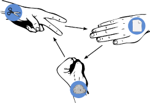

## Overview

We are all familiar with the game Rock Paper Scissors. Let's take a look at how we can code our micro:bits to play.

:::info[Note]
You do not need a micro:bit to do this tutorial you can use the simulator built into the MakeCode editor.
:::

## What you will Learn

- How to create and use a Variable
- How to use the micro:bit on shake function
- How to display images/shapes on the LED matrix
- How to use conditional if/else statements
- How to use comparison operators
- How to randomise choices
