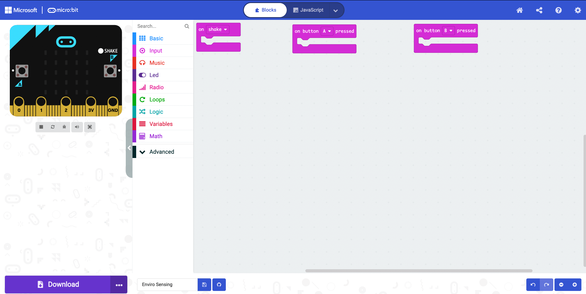
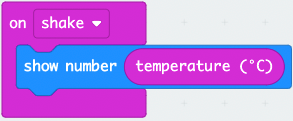
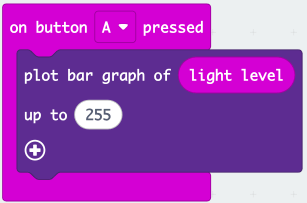
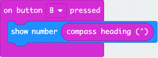
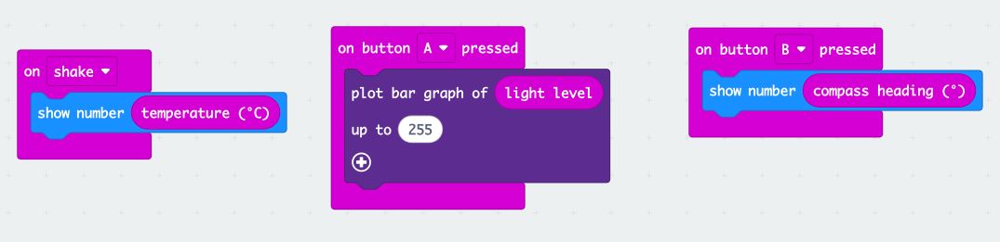

## Setting up the Code Area

1. Select and drag the `on start` block to the left of the screen and **drop it** on the **bin**.

2. Select and drag the `forever` block to the left of the screen and **drop it** on the **bin**.

3. From the Input menu, select and drag the `on shake` block to the code area and drop it.

4. From the Input menu, select and drag a `on button A pressed` block to the code area and drop it.

5. Right-click on the `on button A pressed` block and select **duplicate**.On the duplicated block select the **little arrow** next to **A** and choose **B**.

Your code area will now look like this:

## Temperature Sensing

1. From the Basic menu, select and drag a `show number` block to the code area and attach it within the `on shake` block.

2. From the Input menu, select and drag a `temperature` block to the code area and attach it within the **0** of the `show number` block.

We can now sense the temperature around us.

## Light Sensing

1. From the Led menu, select and drag a `plot bar graph of` block to the code area and attach it within the `on button A pressed` block.

2. From the Input menu, select and drag a `light level` block to the code area and attach it within the **0** of the `plot bar graph of` block.

3. Type **255** within the **0** of the `up to`line.

This will plot a graph on the LED matrix of the amount of light in your environment when the A button is pressed.

## Compass Sensing

1. From the Basic menu, select and drag a `show number` block to the code area and attach it within the `on button B` pressed.

2. From the Input menu, select and drag the `compass heading` block to the code area and attach it within the **0** of `show number`.

## Completed Code

Here is what our completed code looks like:

We are now ready to download the code to our micro:bit so we can go out and sense our environment.
