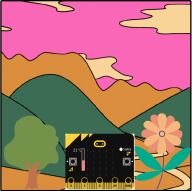

## Overview

We are going to explore our environment by using the temperature sensor, light sensor and compass on the micro:bit.

:::info[Note]
You do not need a micro:bit to do this tutorial you can use the simulator built into the MakeCode editor.
:::

## What you will Learn

How to;

- [ ] Use the on shake function.
- [ ] Display a number on the LED matrix.
- [ ] Use the temperature sensor.
- [ ] Use the button function.
- [ ] Use the if/else conditions.
- [ ] Use comparison operators.
- [ ] Display patterns on the LED matrix.
- [ ] Clear the LED matrix.
- [ ] Use the compass.
  
Let's open our code editor.
