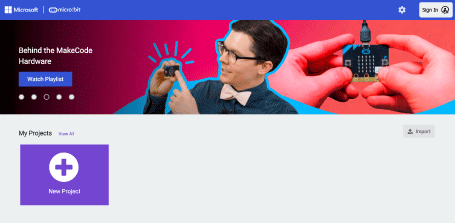

## Navigating to MakeCode

1. Open your favourite browser ( we recommend Google Chrome) or if you are using a mobile phone or tablet open the micro:bit app.

2. Within the address bar of the browser type [makecode.microbit.org](https://makecode.microbit.org/) or on a tablet or phone press create code.

   

3. Select **New Project** and give it the name **Enviro Sensing**.

We are now ready to start coding!
