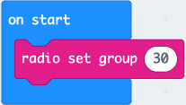

## Setting the Radio Group

1. Select and drag the `forever` block to the left and drop it on the **bin**.

2. From Radio select and drag a `radio set group 1` block to the code area and attach it within the `on start` block. Change **1** to **30**.

:::tip[WORKING WITH MULTIPLE PAIRS]
If you are working with more than one group of pairs, make sure each pair is on a different radio group.
:::

## Outgoing Message

1. From Input select and drag an `on shake` block to the code area and drop it.

2. From Basic select and drag a `clear screen` block to the code area and attach it within the `on shake` block.

3. From Radio select and drag a `radio send string “ “` block to the code area and attach it under the `clear screen` block. Within the **blank** space type **GHOST**.

## Incoming Message

1. From Radio select and drag an `on radio received received string` block to the code area and drop it.

2. From Basic select and drag a `show icon` block to the code area and attach it within the `on radio received received string` block. Select the **heart** and pick the **ghost** icon.

Completed Code:

Now that we have completed our code, lets move on and download it to our micro:bits.
