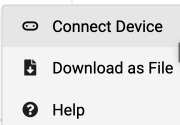
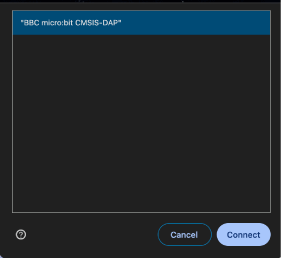

## Downloading the code to the micro:bit

1. Select the **3 dots** next to **Download**.

2. Select **pair device** a pop-up will come on screen to show you how to connect the micro:bit to the computer. Select **pair device** again.

3. Select **BBC micro:bit xxxx** and Select **connect**.

4. Select Download.

Now that we have downloaded our code, let's find out how to play.
