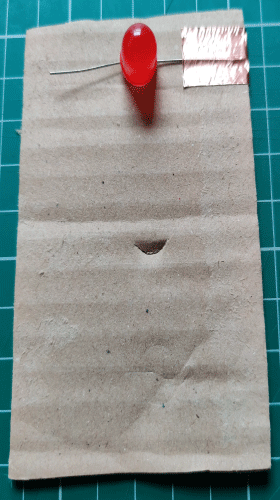
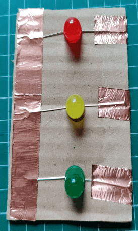

## What is an LED

An LED (Light Emitting Diode) is a small light bulb that lights up when electricity flows through it. It's just like the tiny lights you see on your toys, TV, or Christmas decorations!
Every LED has two legs:

- A longer leg (called the positive or + side)
- A shorter leg (called the negative or - side)

Think of these legs like the LED's feet - they need to be connected the right way around for the LED to work. Just remember: Long leg = Positive (+), Short leg = Negative (-). If you connect them the wrong way around, your LED won't light up!

## Creating the Circuit

1. Place the bit of cardboard on the desk.
   
2. Take the red LED and bend the legs out to the sides. Place the LED on the cardboard with the longer leg to the right.

3. Take a bit of copper tape or glue and some aluminium foil over the long leg of the red LED.

4. Complete steps 2 and 3 for the yellow and green LEDs.

5. Take a longer bit of copper tape or foil and tape/glue all three of the short legs of the LEDs together.

## Connecting to the micro:bit

1. Take one of the crocodile/alligator leads and clip one end to the long piece of copper tape/aluminium foil covering the short legs of the LEDs and clip the other end to the GND pin of the micro:bit.

2. Take another crocodile/alligator lead and clip one end to the copper tape/aluminium foil of the longer leg of the red LED and attach the other end to pin 0 on the micro:bit.

3. Take another crocodile/alligator lead and clip one end to the copper tape/aluminium foil of the longer leg of the yellow LED and attach the other end to pin 1 on the micro:bit.

4. Take the last crocodile/alligator lead and clip one end to the copper tape/aluminium foil of the longer leg of the green LED and attach the other end to pin 2 on the micro:bit.

We now have our circuit lets move on to setting up our code editor.
