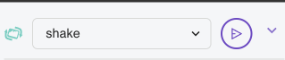

Well done you have created your very own Rock Paper Scissors game for the micro:bit.

## Web Browser

The Python Editor has a built-in micro:bit simulator so you can use this if you don't have a micro:bit handy.

Under the micro:bit simulator you will see that the shake function is selected and if you click on the play button next to it this will simulate the micro:bit being shaken and display either the rock, paper or scissors icon on the LED matrix.

## Using the micro:bit

Once you have downloaded the code to your micro:bit you can shake the micro:bit and see a rock, paper or scissors image appear on it.

Find a partner and start playing or play against yourself.