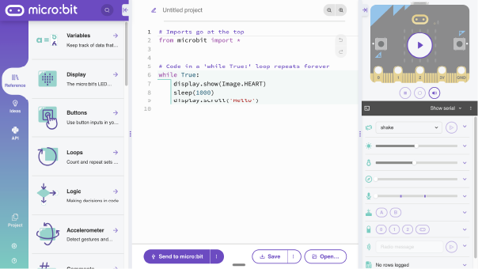
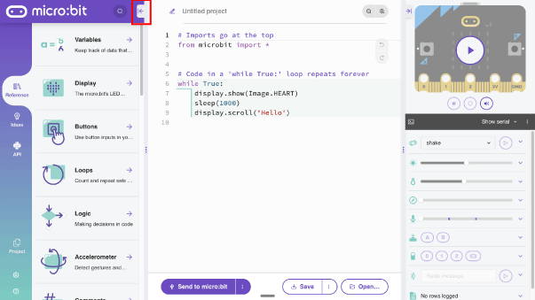
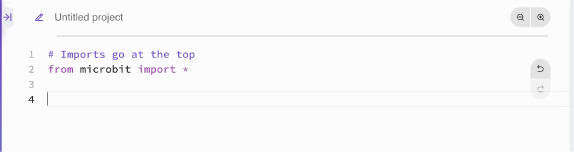

## Navigating to the Python Editor

1. Open your favourite browser ( we recommend Google Chrome).

2. Within the address bar of the browser type [python.microbit.org](https://python.microbit.org/) or on a tablet or phone press create code.

3. Close the left hand panel by selecting the arrow pointing to the left. See the image below.

4. Delete the code from line 5 -9 on the main code area.

We are now ready to start coding!