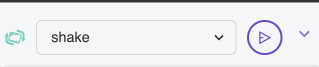
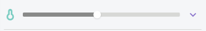
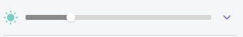
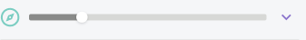

Well done you have created your very own environment sensing micro:bit.

## Web Browser

The Python Editor has a built-in micro:bit simulator so you can use this if you don't have a micro:bit handy.

### Temperature Sensing

Under the micro:bit simulator you will see that the shake function is selected and if you click on the play button next to it this will simulate the micro:bit being shaken and display the temperature on screen.

We can also edit the temperature reading by moving the slider next to the little thermometer.

### Light Sensing

Below the micro:bit simulator you will see a **sun** icon. We can move this slider to simulate light levels. When the slider is below 100 we will get a smiley face displayed on the LED matrix when we press the A button. If the slider is above 100 the LED matrix will remain blank.

### Compass Sensing

Below the micro:bit simulator you will see a **compass** icon. We can move this slider to simulate the compass reading then we can display the reading on the LED matrix when we press the B button.

## Using the micro:bit

### Temperature Sensing

Shake the micro:bit to get a temperature reading on the LED matrix.

### Light Sensing

When the light level is below 100 we will get a smiley face displayed on the LED matrix when we press the A button. If the Light Level is above 100 the LED matrix will remain blank.

### Compass Sensing

 Press the B button to detect which direction we are facing.

:::info[NOTE]
If you are using the compass for the first time, you will get a message to move the micro:bit around to light every LED up on the LED matrix. This is to calibrate the micro:bit to get an accurate as possible compass reading.
:::

Now go around different room/outdoors to see the difference in temperature and light level.
