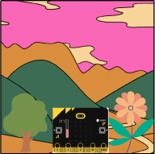

## Overview

Ever wondered how we can use technology to understand the world around us? In this exciting project, you will become an environmental detective using your micro:bit's built-in superpowers!

Just like our five senses help us explore the world, your micro:bit has special sensors that can tell you:

- How warm or cold it is using its temperature sensor
- How bright or dark it is using its light sensor
- Which direction you're facing using its compass

## What you will Learn

- [ ] Display temperature readings
- [ ] Create a light meter that reacts to brightness
- [ ] Build a digital compass to find your way

## What you will Need

- 1 x micro:bit
- 1 x micro USB cable
- 1 x battery pack for the micro:bit (optional)

Are you ready to start exploring? Let's begin our environmental adventure!
