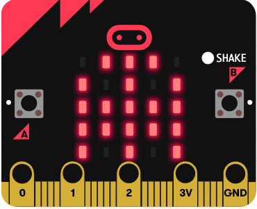

## Overview

The Teleporting Ghost project brings coding to life by creating an interactive ghost that can magically travel between two micro:bits! Using the micro:bit's built-in motion sensor and radio capabilities, you will learn how devices can communicate wirelessly while creating a fun and spooky experience.

## What you will Learn

This hands-on project introduces important programming concepts like:

- [ ] Wireless communication between devices
- [ ] Using sensors (accelerometer) to detect motion
- [ ] Creating custom images using LED displays
- [ ] Understanding basic program flow and logic

## What you will Need

- 1 x micro:bit
- 1 x micro USB cable
- 1 x battery pack for the micro:bit (optional)

The project is not only entertaining but also demonstrates how modern devices can sense movement and share information wirelessly - the same technology used in everything from video game controllers to smart home devices.
