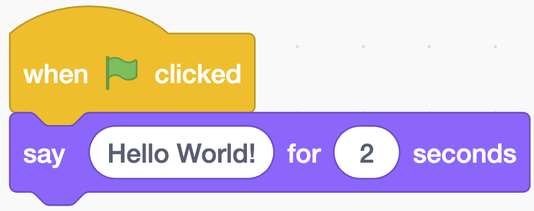

## Activity: "Hello, World!"

### Step-by-step Instructions

1. **Open Scratch**
    - Go to [scratch.mit.edu](https://scratch.mit.edu/)
    - Click the **Create** button
2. **Create Your First Script**
    - From the **Events** category (yellow), drag **when green flag clicked**
    - From the **Looks** category (purple), drag **say Hello, World! for 2 seconds**
    - Connect the blocks by snapping them together
3. **Completed Code**
  
4. **Test Your Code**
    - Click the green flag above the stage
    - Watch your sprite say "Hello, Library!"
5. **Experiment**
    - Change the message
    - Try different durations
    - Add sound from the Sound category

## What Children Learn

- How to connect code blocks
- The concept of events (green flag starts the program)
- Immediate feedback and results
